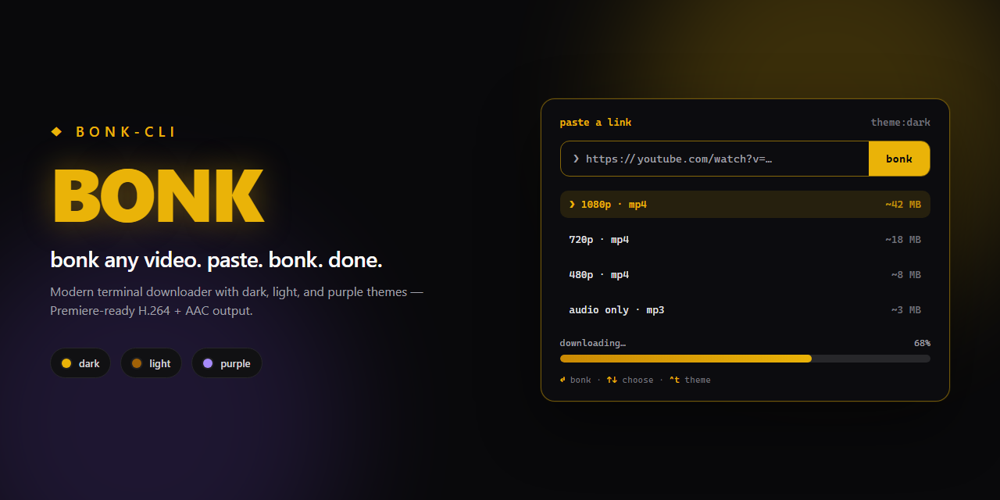

# bonk

<p align="center">
  
</p>

**bonk** is a full-screen terminal downloader for people who edit. Drop a link, pick a quality (or mp3), get a file Premiere Pro will actually open — no “unsupported compression type” drama.

YouTube, X, Instagram, Threads, TikTok, and ~1,800 other sites via [yt-dlp](https://github.com/yt-dlp/yt-dlp). Playlists included: download the whole lineup or choose one clip, then pick the format.

```sh
npx bonk-cli
npx bonk-cli 'https://youtu.be/dQw4w9WgXcQ'
bonk --update   # refresh the bundled yt-dlp
```

## Why bonk exists

Most “download this video” tools dump whatever the CDN hands you. On YouTube that often means **VP9 / AV1** wrapped in a `.mp4` — and Premiere refuses it.

bonk prefers native **H.264 + AAC**, and only re-encodes when it has to (`veryfast` x264). Cookies, Node JS runtime flags, and remote EJS components are always on so modern sites keep working.

| What arrived | What you get | Cost |
|--------------|--------------|------|
| H.264 + AAC MP4 | keep / rename | basically free |
| H.264 + other audio | copy video, AAC audio | quick |
| VP9 / AV1 | H.264 re-encode | slower, only when needed |

## Install

**npm package name is `bonk-cli`** (plain `bonk` was already taken). The command is still `bonk`.

```sh
# one-shot
npx bonk-cli

# global
npm install -g bonk-cli
bonk
```

**Needs:** Node 18+, `ffmpeg` on PATH (or the bundled `ffmpeg-static`), and a Netscape **`cookies.txt`**.

### cookies.txt

bonk always runs yt-dlp like this:

```sh
yt-dlp --cookies cookies.txt --js-runtimes node --remote-components ejs:github [URL]
```

Put the export at either:

- `./cookies.txt` (cwd — preferred)
- `~/.bonk/cookies.txt`

Browser extensions such as “Get cookies.txt LOCALLY” work while you’re logged into the sites you care about.

## Commands

```sh
bonk                              # interactive — drop a link
bonk <url>                        # jump straight into the flow
bonk <playlist-url>               # download all or pick one, then choose quality
bonk --theme dark|light|purple    # start on a palette
bonk -U / --update                # self-update ~/.bonk/bin/yt-dlp
bonk -h / -v                      # help / version
```

Inside the TUI:

| Input | Action |
|-------|--------|
| `↵` | bonk / confirm |
| `↑` `↓` | move in lists |
| `⇥` | pull a link from the clipboard (when offered) |
| `esc` | back / cancel |
| `^t` | cycle theme |
| `^c` | quit |
| mouse | button, lists, footer, logo (home) |

Files land in **`~/Downloads`**. The final path is printed when you leave the full-screen UI.

### Themes

| Mode | Vibe |
|------|------|
| `dark` (default) | near-black + gold |
| `light` | warm paper + amber |
| `purple` | deep violet + lilac |

### Updating yt-dlp

On first need, bonk can install a private binary under `~/.bonk/bin`. Keep it current with:

```sh
bonk --update
# same as: bonk -U   → runs yt-dlp -U on the bundled binary
```

## Under the hood

- **yt-dlp** — fixed base flags (cookies + node runtime + remote EJS)
- **ffmpeg** — merge + Premiere-safe pass (`ffmpeg-static` fallback)
- **Ink** — React for the terminal UI

## Develop

```sh
npm install
npm run build
npm run dev
node dist/cli.js <url>
npm test && npm run typecheck
```

## Fair use

bonk is for personal archives and edit prep. Only grab media you’re allowed to keep. Be decent to creators.

## Credits

- [yt-dlp](https://github.com/yt-dlp/yt-dlp) — the download engine
- [Ink](https://github.com/vadimdemedes/ink) — terminal React
- Nods to [yoinks](https://github.com/pablostanley/yoinks) by [Pablo Stanley](https://github.com/pablostanley) for popularizing a full-screen paste → pick → download flow in the terminal

## License

[MIT](LICENSE)
